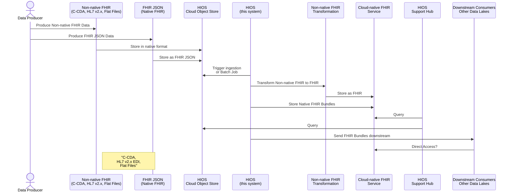
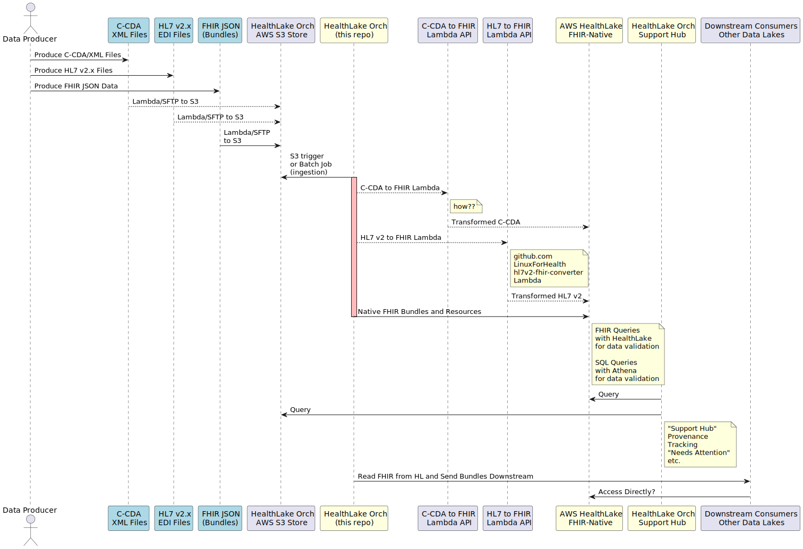

# Healthcare Information Orchestration System (HIOS)

## Introduction

Welcome to the **Healthcare Information Orchestration System (HIOS)**, a
comprehensive system designed to streamline the ingestion, transformation, and
integration of healthcare data into cloud-native FHIR services. Initially
designed for AWS HealthLake, HIOS provides a flexible framework that can be
extended to support other cloud providers like Microsoft Azure, Oracle, or
Google, provided they offer fully managed object stores and FHIR services.

### Overall Strategy

Healthcare organizations and aggregators, such as Health Information Exchanges
(HIEs), generate and manage vast amounts of healthcare data in multiple formats,
including C-CDA (Consolidated Clinical Document Architecture), HL7 v2.x (Health
Level 7 version 2.x), and FHIR JSON Bundles. HIOS is designed to ingest these
different data formats, transform them into FHIR-compliant resources, and store
them within a fully managed FHIR service on your chosen cloud platform.

HIOS's initial implementation is built for AWS HealthLake, leveraging AWS S3 for
secure data storage and Lambda for transformation processes. However, the system
is architected with flexibility in mind, allowing for potential expansion to
other cloud providers that offer similar capabilities. Whether your data is in
traditional formats like C-CDA and HL7 or modern FHIR Bundles, HIOS can handle
them. Even if your data is stored in flat files or other non-standard formats,
HIOS can be extended to manage those as well.

As cloud services evolve, HIOS could be expanded into a multi-service proxy and
router, enabling the mixing and matching of services across different cloud
providers. This would allow healthcare organizations to leverage the best
features from each platform while maintaining a consistent data management
strategy.

### Cloud Strategy

HIOS is designed with a cloud-agnostic approach in mind. The strategy is to use
cloud-native features such as fully managed object stores (like AWS S3) and FHIR
services (like AWS HealthLake) to build a robust, scalable, and interoperable
healthcare data management system. The principles applied in AWS HealthLake can
be similarly applied to other cloud providers, making HIOS a future-proof
solution for multi-cloud environments.

## Technical Overview

The Healthcare Information Orchestration System (HIOS) is an orchestration
system that manages the ingestion, transformation, and storage of various
healthcare data formats into cloud-native FHIR services. The system is designed
to support common healthcare standards such as HL7 v2.x, C-CDA, and FHIR, with
the flexibility to accommodate other formats like flat files.

### Supported Data Formats

- **C-CDA (Consolidated Clinical Document Architecture)**
- **HL7 v2.x (Health Level 7 version 2.x EDI Files)**
- **FHIR JSON Bundles**
- **Flat Files** (and other non-standard formats, through customizable
  transformation pipelines)

### Orchestration Flow



#### AWS HealthLake Orchestration Flow



### Extensibility and Future Vision

HIOS is initially designed for AWS HealthLake, but its architecture is
cloud-agnostic, allowing for future expansion to other cloud providers like
Microsoft Azure, Oracle, or Google. The strategy and principles applied in the
initial version can be adapted to other platforms, making HIOS a flexible and
scalable solution for multi-cloud environments.

In the future, HIOS could evolve into a multi-service proxy and router, allowing
healthcare organizations to mix and match services from different cloud
providers. This would enable organizations to leverage the strengths of various
platforms while maintaining a consistent and interoperable data management
strategy.

### Key Benefits

- **Interoperability**: HIOS ensures that healthcare data from various sources
  can be integrated into a single, standardized FHIR format, regardless of the
  cloud provider.
- **Scalability**: Built on cloud-native services, HIOS can scale to meet the
  needs of any organization, regardless of the volume of data.
- **Flexibility**: With support for various data formats and the ability to add
  custom transformations, HIOS is a versatile tool for modern healthcare data
  management.
- **Multi-cloud Ready**: HIOS’s architecture supports potential expansion to
  multiple cloud providers, enabling a flexible and future-proof data management
  strategy.
- **Compliance**: HIOS’s design ensures compliance with legal and regulatory
  requirements, providing secure and controlled access to healthcare data.

HIOS is your gateway to efficient and standardized healthcare data management
across cloud platforms, providing the tools you need to harness the full
potential of cloud-native FHIR services. Whether you're dealing with legacy data
formats, modern FHIR resources, or managing data across multiple clouds, HIOS
has you covered.

---

## Developer Sandbox Setup

Review [AWS HealthLake README](support/docs/README-aws-healthlake.md) and
[healthlake-experimental-stack.aws-cdk](support/lib/healthlake-experimental-stack.aws-cdk.ts)
to learn what basic setup to do for AWS and then:

```bash
BUCKET_NAME=<your-S3-bucket-name>
DATASTORE_ID=<healthlake-datastore-ID>
DAROLE_ARN=<S3-bucket-data-access-role-arn>

$ ./support/bin/hiosctl.py doctor --bucket-name $BUCKET_NAME --datastore-id $DATASTORE_ID
$ ./support/bin/hiosctl.py store-s3 --bucket-name $BUCKET_NAME --path support/synthetic-test-fixtures/fhir-bundles/
$ ./support/bin/hiosctl.py ingest-healthlake --bucket-name $BUCKET_NAME --datastore-id $DATASTORE_ID --darole-arn "$DAROLE_ARN"
```
