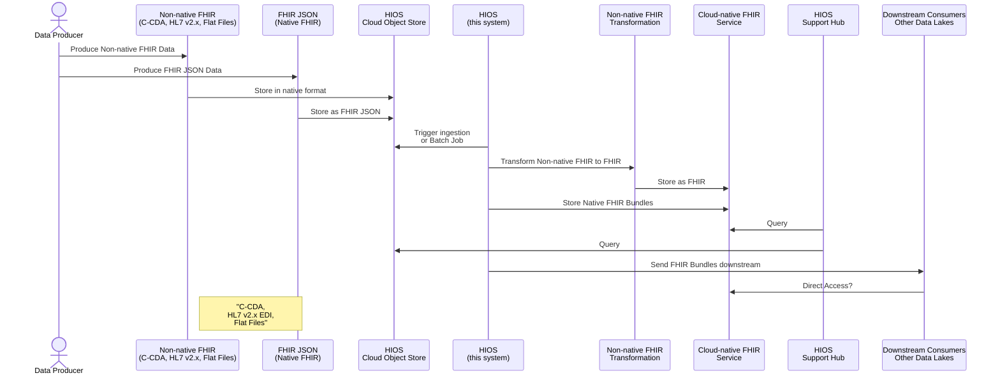
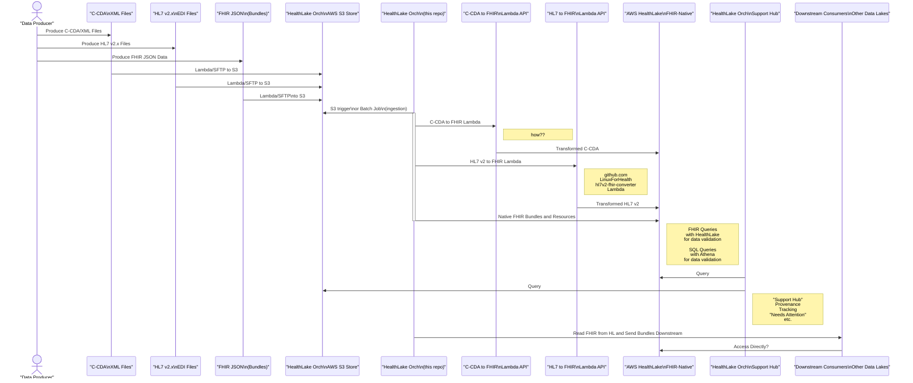

# Healthcare Information Orchestration System (HIOS)

## Introduction

Welcome to the **Healthcare Information Orchestration System (HIOS)**, a
comprehensive system designed to streamline the ingestion, transformation, and
integration of healthcare data into cloud-native FHIR services. Initially
designed for AWS HealthLake, HIOS provides a flexible framework that can be
extended to support other cloud providers like Microsoft Azure, Oracle, or
Google, provided they offer fully managed object stores and FHIR services.

### Overall Strategy

Healthcare organizations and aggregators, such as Health Information Exchanges
(HIEs), generate and manage vast amounts of healthcare data in multiple formats,
including C-CDA (Consolidated Clinical Document Architecture), HL7 v2.x (Health
Level 7 version 2.x), and FHIR JSON Bundles. HIOS is designed to ingest these
different data formats, transform them into FHIR-compliant resources, and store
them within a fully managed FHIR service on your chosen cloud platform.

HIOS's initial implementation is built for AWS HealthLake, leveraging AWS S3 for
secure data storage and Lambda for transformation processes. However, the system
is architected with flexibility in mind, allowing for potential expansion to
other cloud providers that offer similar capabilities. Whether your data is in
traditional formats like C-CDA and HL7 or modern FHIR Bundles, HIOS can handle
them. Even if your data is stored in flat files or other non-standard formats,
HIOS can be extended to manage those as well.

As cloud services evolve, HIOS could be expanded into a multi-service proxy and
router, enabling the mixing and matching of services across different cloud
providers. This would allow healthcare organizations to leverage the best
features from each platform while maintaining a consistent data management
strategy.

### Cloud Strategy

HIOS is designed with a cloud-agnostic approach in mind. The strategy is to use
cloud-native features such as fully managed object stores (like AWS S3) and FHIR
services (like AWS HealthLake) to build a robust, scalable, and interoperable
healthcare data management system. The principles applied in AWS HealthLake can
be similarly applied to other cloud providers, making HIOS a future-proof
solution for multi-cloud environments.

## Technical Overview

The Healthcare Information Orchestration System (HIOS) is an orchestration
system that manages the ingestion, transformation, and storage of various
healthcare data formats into cloud-native FHIR services. The system is designed
to support common healthcare standards such as HL7 v2.x, C-CDA, and FHIR, with
the flexibility to accommodate other formats like flat files.

### Supported Data Formats

- **C-CDA (Consolidated Clinical Document Architecture)**
- **HL7 v2.x (Health Level 7 version 2.x EDI Files)**
- **FHIR JSON Bundles**
- **Flat Files** (and other non-standard formats, through customizable
  transformation pipelines)

### Orchestration Flow



#### AWS HealthLake Orchestration Flow



### Extensibility and Future Vision

HIOS is initially designed for AWS HealthLake, but its architecture is
cloud-agnostic, allowing for future expansion to other cloud providers like
Microsoft Azure, Oracle, or Google. The strategy and principles applied in the
initial version can be adapted to other platforms, making HIOS a flexible and
scalable solution for multi-cloud environments.

In the future, HIOS could evolve into a multi-service proxy and router, allowing
healthcare organizations to mix and match services from different cloud
providers. This would enable organizations to leverage the strengths of various
platforms while maintaining a consistent and interoperable data management
strategy.

### Key Benefits

- **Interoperability**: HIOS ensures that healthcare data from various sources
  can be integrated into a single, standardized FHIR format, regardless of the
  cloud provider.
- **Scalability**: Built on cloud-native services, HIOS can scale to meet the
  needs of any organization, regardless of the volume of data.
- **Flexibility**: With support for various data formats and the ability to add
  custom transformations, HIOS is a versatile tool for modern healthcare data
  management.
- **Multi-cloud Ready**: HIOS’s architecture supports potential expansion to
  multiple cloud providers, enabling a flexible and future-proof data management
  strategy.
- **Compliance**: HIOS’s design ensures compliance with legal and regulatory
  requirements, providing secure and controlled access to healthcare data.

HIOS is your gateway to efficient and standardized healthcare data management
across cloud platforms, providing the tools you need to harness the full
potential of cloud-native FHIR services. Whether you're dealing with legacy data
formats, modern FHIR resources, or managing data across multiple clouds, HIOS
has you covered.

---

## AWS Developer Sandbox Setup

The following are necessary steps to set up an AWS environment for experimental
use with the `hiosctl.py` script. The setup described here is intended for
development and testing purposes only. In a production environment, additional
security measures would be required to protect sensitive data and ensure
compliance with best practices.

**For DevOps**

Review
[healthlake-experimental-stack.aws-cdk](support/lib/healthlake-experimental-stack.aws-cdk.ts)
to see a non-working starting point for HIOS IaC.

## 0. AWS Account Setup

### Step 1: Go to the AWS Website

1. Open your web browser (like Chrome, Firefox, or Safari).
2. In the address bar, type **`www.aws.amazon.com`** and press **Enter**.
3. You'll be on the Amazon Web Services (AWS) homepage.

### Step 2: Start the Sign-Up Process

1. Look for a big button that says **"Create an AWS Account"** and click it.
   - If you don't see the button, click on the "Sign In to the Console" link at the top-right of the page, and then select **"Create a new AWS account"**.

### Step 3: Enter Your Email and Choose a Password

1. On the "Sign Up" page:
   - In the **Email address** box, type in your email address.
   - In the **Password** box, create a password that you'll remember. Make sure it has at least 8 characters, with a mix of letters and numbers.
   - In the **Confirm password** box, type the password again to make sure you got it right.
   - In the **AWS account name** box, type a name for your account (e.g., "My First AWS Account").
2. Click on the **Continue** button.

### Step 4: Enter Your Contact Information

1. On the "Contact Information" page:
   - Choose **Personal** for the account type.
   - Fill in your full name, phone number, and address.
   - Check the box that says you’ve read and agreed to the AWS Customer Agreement.
2. Click on the **Continue** button.

### Step 5: Add Payment Information

1. On the "Payment Information" page:
   - You need to enter your credit or debit card information. Don't worry, AWS offers a **Free Tier**, which means you won’t be charged unless you go over the free limits.
   - Fill in your card number, expiration date, and name as it appears on the card.
   - AWS may place a small temporary charge (like $1) to verify your card, but this charge will disappear after a few days.
2. Click on the **Verify and Continue** button.

### Step 6: Confirm Your Identity

1. On the "Identity Verification" page:
   - Choose whether you want to receive a text message or a voice call to verify your identity.
   - Enter your phone number and click on the **Send SMS** or **Call me now** button.
2. AWS will send you a verification code. Enter the code you receive and click on **Verify code**.
3. Click on **Continue**.

### Step 7: Choose a Support Plan

1. On the "Support Plan" page:
   - Select the **Basic Plan (Free)**. This is all you need to get started, and it's completely free.
2. Click on **Complete Sign Up**.

### Step 8: Wait for the Confirmation

1. You should see a confirmation page saying that your account is being activated. This usually takes a few minutes but can take up to 24 hours.
2. AWS will send you a confirmation email once your account is ready.

### Step 9: Sign In to Your AWS Account

1. Once you receive the confirmation email, go back to the AWS homepage (**`www.aws.amazon.com`**).
2. Click on the **Sign In to the Console** button.
3. Enter your email address and password that you used to create the account.
4. Click **Sign In**.

### 1. IAM User and Role Setup

#### 1. Create an IAM User

1. **Sign in to the AWS Management Console:**
   - Open your web browser and go to **[AWS Management Console](https://aws.amazon.com/console/)**.
   - Log in with your AWS account credentials.

2. **Navigate to the IAM Service:**
   - In the AWS Management Console, type **"IAM"** in the search bar and select **IAM** from the dropdown.

3. **Create a New User:**
   - In the IAM Dashboard, click on **Users** in the left-hand menu.
   - Click the **Add User** button.
   - Enter a username. Suggested name: `your-name`.
   - Under **Access type**, check the box for **Programmatic access**. This allows the user to interact with AWS via the AWS CLI, SDKs, and APIs.

4. **Assign Policies to the User:**
   - Click **Next: Permissions**.
   - Select **Attach existing policies directly**.
   - In the search bar, type and select the following policies:
     - **IAMFullAccess**: Grants full access to IAM for managing users, groups, roles, and policies.
     - **AmazonS3FullAccess**: Grants full access to Amazon S3, allowing the user to manage and interact with S3 buckets.
     - **AWSHealthLakeFullAccess**: Grants full access to AWS HealthLake services.

5. **Review and Create the User:**
   - Click **Next: Tags** (you can skip adding tags).
   - Click **Next: Review** to see a summary of the user details and permissions.
   - Click **Create User**.

#### 2. Generate an Access Key and Secret Access Key

1. **View User Credentials:**
   - After creating the user, you will be presented with a success page that shows the **Access key ID** and **Secret access key**.
   - **Download the CSV file** with the credentials or copy them to a secure location. These keys are essential for programmatic access using the `HealthInfoOrchestrator.java` class.

2. **Store the Keys Securely:**
   - Treat these keys like a password. Do not share them or check them into version control systems.

#### 3. Create an IAM Role

1. **Navigate to IAM Roles:**
   - In the IAM Dashboard, click on **Roles** in the left-hand menu.
   - Click the **Create Role** button.

2. **Select Trusted Entity:**
   - Under **Select trusted entity**, choose **AWS Service**.
   - Select **HealthLake** as the use case (or search for it in the services dropdown).

3. **Assign Policies to the Role:**
   - Click **Next: Permissions**.
   - In the search bar, type and select the following policies:
     - **AmazonS3FullAccess**: Grants the role permissions to access and interact with S3 buckets where FHIR data is stored.
     - **AWSHealthLakeFullAccess**: Grants the role permissions to interact with AWS HealthLake services.
   - Optionally, if you need the role to have full permissions for IAM, you can also attach the **IAMFullAccess** policy, though this is generally not recommended for least privilege.

4. **Set Role Name:**
   - Click **Next: Tags** (you can skip adding tags).
   - Click **Next: Review**.
   - Enter a role name. Suggested name: `hios-experiment-api-prime-role`.
   - Click **Create Role**.

5. **Note the Role ARN:**
   - After creating the role, click on the role name in the list to view its details.
   - Copy the **Role ARN** (Amazon Resource Name). You will need this ARN when configuring `HealthInfoOrchestrator.java` to ensure it can assume this role for necessary permissions.

#### 4. Configure the `HealthInfoOrchestrator.java` Class

1. **Update the Java Code:**
   - Ensure that the `HealthInfoOrchestrator.java` class is configured to use the Access Key, Secret Access Key, and Role ARN created above.
   - The AWS SDK for Java will automatically use these credentials if they are properly configured in your environment or passed as part of your application setup.

2. **Environment Variables:**
   - You can export the Access Key and Secret Access Key as environment variables on your system:
     ```bash
     export AWS_ACCESS_KEY_ID='your-access-key-id'
     export AWS_SECRET_ACCESS_KEY='your-secret-access-key'
     export AWS_REGION='your-aws-region'
     ```
   - These variables ensure that the Java application can authenticate with AWS services.

3. **Role Assumption in Java:**
   - Ensure that your Java application is set up to assume the IAM role using the provided Role ARN for interacting with AWS HealthLake and S3 services.


### 2. S3 Bucket Setup

#### A. Creating the S3 Bucket

1. **Sign in to the AWS Management Console:**
   - Open your web browser and go to **[AWS Management Console](https://aws.amazon.com/console/)**.
   - Log in with your AWS account credentials.

2. **Navigate to the S3 Service:**
   - In the AWS Management Console, type **"S3"** in the search bar and select **S3** from the dropdown.

3. **Create a New Bucket:**
   - Click the **Create bucket** button.
   - Enter a unique bucket name. Suggested name: `hios-experiment-prime`.
   - Select the appropriate AWS Region where you want the bucket to be created.

4. **Enable Default Encryption:**
   - Scroll down to the **Bucket settings for Block Public Access** and ensure it is enabled to prevent unauthorized access.
   - In the **Default encryption** section, enable **Server-Side Encryption** with S3-managed keys (SSE-S3).
   - This ensures that all objects stored in the bucket are automatically encrypted.

5. **Review and Create the Bucket:**
   - Leave the rest of the settings as default and click **Create bucket**.
   - Your new bucket will appear in the S3 console.

#### B. Configure Bucket Policies and Access

1. **Assign Bucket Policy for IAM User and Role:**
   - Navigate to your newly created bucket in the S3 console.
   - Click on the **Permissions** tab.
   - Under **Bucket policy**, click **Edit** and add the following policy, replacing `YOUR_BUCKET_NAME`, `IAM_USER_ARN`, and `IAM_ROLE_ARN` with your actual bucket name, IAM user ARN, and IAM role ARN respectively:

   ```json
   {
       "Version": "2012-10-17",
       "Statement": [
           {
               "Effect": "Allow",
               "Principal": {
                   "AWS": [
                       "arn:aws:iam::YOUR_ACCOUNT_ID:user/YOUR_IAM_USER_NAME",
                       "arn:aws:iam::YOUR_ACCOUNT_ID:role/YOUR_IAM_ROLE_NAME"
                   ]
               },
               "Action": [
                   "s3:GetObject",
                   "s3:PutObject",
                   "s3:ListBucket"
               ],
               "Resource": [
                   "arn:aws:s3:::YOUR_BUCKET_NAME",
                   "arn:aws:s3:::YOUR_BUCKET_NAME/*"
               ]
           }
       ]
   }
    ```
#### C. Using the Bucket in the HealthInfoOrchestrator.java

1. **Pass the S3 Bucket Name in the Environment Configuration:**
   - You can specify the S3 bucket name using an environment variable in your `.envrc` file:
     ```bash
     export AWS_S3_BUCKET_NAME='your-existing-bucket-name'
     export AWS_REGION='us-east-2'
     ```
   - If the environment variable `AWS_S3_BUCKET_NAME` is set, the application will use the specified bucket.

2. **Automatic Bucket Creation if Not Provided:**
   - If no bucket name is provided via the environment variable, the `HealthInfoOrchestrator.java` class is designed to automatically create a new S3 bucket.
   - The bucket name will be dynamically generated to ensure uniqueness, as shown in the `HealthInfoOrchestratorTest` class:

   ```java
   bucketName = "test-bucket-" + UUID.randomUUID() + "-" + System.currentTimeMillis();

   Consumer<AmazonS3> ifNotExist = (AmazonS3 s3Client) -> {
       if (!s3Client.doesBucketExistV2(bucketName)) {
           System.out.println("Bucket " + bucketName + " does not exist. Creating it now.");
           s3Client.createBucket(new CreateBucketRequest(bucketName, region));
       } else {
           System.out.println("Bucket " + bucketName + " already exists. No action needed.");
       }
   };
   ```

### 3. AWS HealthLake Datastore Setup


1. **Set up a HealthLake Datastore:**
   - Create a HealthLake datastore to store and process FHIR data.
   - During the creation process, AWS will automatically manage encryption for the datastore.
   - Suggested datastore name: `hios-experiment-prime`.
   - Ensure that the datastore is configured correctly to interact with your S3 bucket and the IAM role.

2. **Configuring the `HealthInfoOrchestrator.java` for HealthLake Import:**
   - The `HealthInfoOrchestrator.java` class is designed to import FHIR data from the S3 bucket into the AWS HealthLake datastore.
   - For now, the import job is executed via the AWS CLI due to issues encountered with the AWS SDK. However, the plan is to switch to the SDK as the main solution in the future.
   - Ensure the following environment variables are set in your `.envrc` file:
     ```bash
     export HEALTHLAKE_DATASTORE_ID='your-datastore-id'
     export HEALTHLAKE_ROLE_ARN='your-role-arn'
     export KMS_KEY_ID='your-kms-key-id' # Optional: only if using custom KMS keys
     ```
   - These variables ensure that the `HealthInfoOrchestrator` knows where to send the FHIR data and how to authenticate the requests.

3. **HealthLake Import Process (Using AWS CLI):**
   - The `AwsCliHealthLakeFhirStore` class, part of `HealthInfoOrchestrator.java`, currently uses the AWS CLI to start the import job. This is a temporary solution until the AWS SDK is fully implemented.
   - The import process involves the following steps:
     1. Retrieve the latest `.ndjson` file from the S3 bucket.
     2. Construct the S3 URI for the input file and the output location.
     3. Construct and execute an AWS CLI command to start the FHIR import job in HealthLake.

   - Example of how the CLI command is constructed:
     ```java
     final var command = String.format(
         "aws healthlake start-fhir-import-job " +
         "--input-data-config S3Uri=%s " +
         "--datastore-id %s " +
         "--data-access-role-arn \"%s\" " +
         "--job-output-data-config '{\"S3Configuration\": {\"S3Uri\":\"%s\",\"KmsKeyId\":\"%s\"}}' " +
         "--region %s",
         s3Uri,
         datastoreId,
         roleArn,
         outputS3Uri,
         kmsKeyId,
         region);
     ```

   - This command is executed by the `AwsCliInvoker` class, which handles interaction with the AWS CLI.

4. **Monitoring the Import Process:**
   - You can monitor the import job's progress via the AWS Management Console or the AWS CLI.
   - The `HealthInfoOrchestrator` logs the status of the import job to help with debugging and validation.
   - The `wasExecutionSuccessful()` method in the `AwsCliHealthLakeFhirStore` class can be used to check if the CLI command was executed successfully.

5. **Future Plans:**
   - The current reliance on AWS CLI for importing FHIR data is a temporary solution. The development team plans to switch to using the AWS SDK once the issues with the `StartFHIRImportJobRequest` class are resolved.
   - This future transition will streamline the import process and eliminate the need for external CLI invocations, making the system more robust and easier to maintain.

### 4. Environment Configuration

- On the system where `hiosctl.py` will run, export the necessary environment
  variables for AWS authentication:
  ```bash
  export AWS_ACCESS_KEY_ID='your-access-key-id'
  export AWS_SECRET_ACCESS_KEY='your-secret-access-key'
  export AWS_REGION='your-aws-region'
  ```
- These environment variables allow the `hiosctl.py` script to authenticate with
  AWS and interact with the required services.

### 5. Testing and Validation

**Summary**

```bash
   git clone https://github.com/netspective-labs/aws-healthlake-experiments
   cd aws-healthlake-experiments
   brew install direnv        # install direnv
   eval "$(direnv hook zsh)"  # enable direnv
   direnv allow               # apply the env vars
   mvn test                   # run the application 
```


**Elaboration**

- Before using the script, run the `doctor` command to verify that the setup is
  correct. This command checks for the existence of the necessary environment
  variables, S3 bucket access, and HealthLake datastore availability.

  ```bash
  ./hiosctl.py doctor --bucket-name your-bucket-name --datastore-id your-datastore-id
  ```
- Use the `store-s3` command in the script to upload FHIR bundles to the S3
  bucket.

  ```bash
  ./hiosctl.py store-s3 --bucket-name your-bucket-name --path /path/to/synthea_fhir_bundles
  ```

- Use the `ingest-healthlake` command to ingest the FHIR data from S3 into AWS
  HealthLake. Ensure you pass the correct `DataAccessRoleArn` for HealthLake to
  assume.

  ```bash
  ./hiosctl.py ingest-healthlake --bucket-name your-bucket-name --datastore-id your-datastore-id --darole-arn your-darole-arn
  ```

### Important Notes for Production Use

While the setup described above is sufficient for experimental and development
purposes, it is important to note that additional security measures are required
for production environments:

- **Enhanced IAM Policies:** In production, implement the principle of least
  privilege by granting only the necessary permissions to IAM users and roles.
  Avoid using overly permissive policies.
- **Monitoring and Auditing:** Enable CloudTrail, CloudWatch, and other
  monitoring services to track access and operations performed on your AWS
  resources.
- **Data Encryption:** Use customer-managed KMS keys for encrypting sensitive
  data in S3 and AWS HealthLake, and implement key rotation policies.
- **Secure Access Management:** Consider using multi-factor authentication (MFA)
  for IAM users and implementing stricter access controls for sensitive
  operations.

This setup provides a foundation for experimenting with AWS services in a
controlled environment, but remember that a more rigorous security posture is
required when moving to production.
