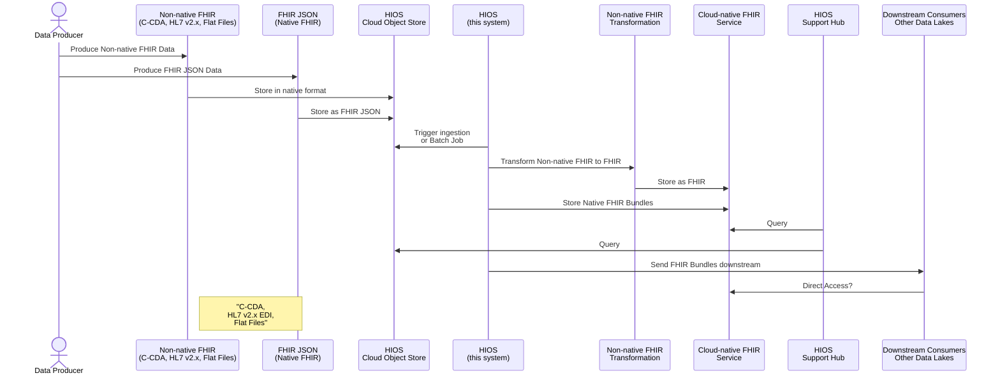
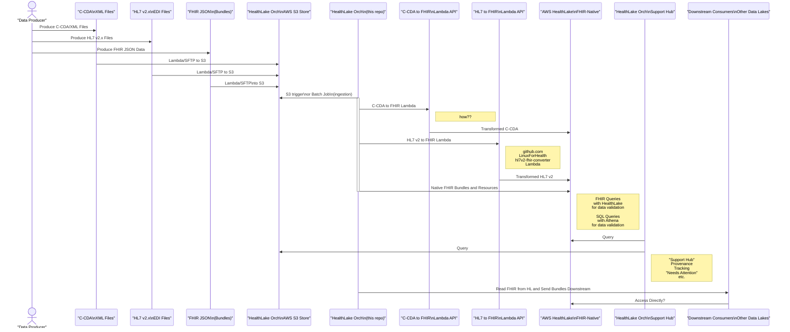

# Healthcare Information Orchestration System (HIOS)

## Introduction

Welcome to the **Healthcare Information Orchestration System (HIOS)**, a
comprehensive system designed to streamline the ingestion, transformation, and
integration of healthcare data into cloud-native FHIR services. Initially
designed for AWS HealthLake, HIOS provides a flexible framework that can be
extended to support other cloud providers like Microsoft Azure, Oracle, or
Google, provided they offer fully managed object stores and FHIR services.

### Overall Strategy

Healthcare organizations and aggregators, such as Health Information Exchanges
(HIEs), generate and manage vast amounts of healthcare data in multiple formats,
including C-CDA (Consolidated Clinical Document Architecture), HL7 v2.x (Health
Level 7 version 2.x), and FHIR JSON Bundles. HIOS is designed to ingest these
different data formats, transform them into FHIR-compliant resources, and store
them within a fully managed FHIR service on your chosen cloud platform.

HIOS's initial implementation is built for AWS HealthLake, leveraging AWS S3 for
secure data storage and Lambda for transformation processes. However, the system
is architected with flexibility in mind, allowing for potential expansion to
other cloud providers that offer similar capabilities. Whether your data is in
traditional formats like C-CDA and HL7 or modern FHIR Bundles, HIOS can handle
them. Even if your data is stored in flat files or other non-standard formats,
HIOS can be extended to manage those as well.

As cloud services evolve, HIOS could be expanded into a multi-service proxy and
router, enabling the mixing and matching of services across different cloud
providers. This would allow healthcare organizations to leverage the best
features from each platform while maintaining a consistent data management
strategy.

### Cloud Strategy

HIOS is designed with a cloud-agnostic approach in mind. The strategy is to use
cloud-native features such as fully managed object stores (like AWS S3) and FHIR
services (like AWS HealthLake) to build a robust, scalable, and interoperable
healthcare data management system. The principles applied in AWS HealthLake can
be similarly applied to other cloud providers, making HIOS a future-proof
solution for multi-cloud environments.

## Technical Overview

The Healthcare Information Orchestration System (HIOS) is an orchestration
system that manages the ingestion, transformation, and storage of various
healthcare data formats into cloud-native FHIR services. The system is designed
to support common healthcare standards such as HL7 v2.x, C-CDA, and FHIR, with
the flexibility to accommodate other formats like flat files.

### Supported Data Formats

- **C-CDA (Consolidated Clinical Document Architecture)**
- **HL7 v2.x (Health Level 7 version 2.x EDI Files)**
- **FHIR JSON Bundles**
- **Flat Files** (and other non-standard formats, through customizable
  transformation pipelines)

### Orchestration Flow



#### AWS HealthLake Orchestration Flow



### Extensibility and Future Vision

HIOS is initially designed for AWS HealthLake, but its architecture is
cloud-agnostic, allowing for future expansion to other cloud providers like
Microsoft Azure, Oracle, or Google. The strategy and principles applied in the
initial version can be adapted to other platforms, making HIOS a flexible and
scalable solution for multi-cloud environments.

In the future, HIOS could evolve into a multi-service proxy and router, allowing
healthcare organizations to mix and match services from different cloud
providers. This would enable organizations to leverage the strengths of various
platforms while maintaining a consistent and interoperable data management
strategy.

### Key Benefits

- **Interoperability**: HIOS ensures that healthcare data from various sources
  can be integrated into a single, standardized FHIR format, regardless of the
  cloud provider.
- **Scalability**: Built on cloud-native services, HIOS can scale to meet the
  needs of any organization, regardless of the volume of data.
- **Flexibility**: With support for various data formats and the ability to add
  custom transformations, HIOS is a versatile tool for modern healthcare data
  management.
- **Multi-cloud Ready**: HIOS’s architecture supports potential expansion to
  multiple cloud providers, enabling a flexible and future-proof data management
  strategy.
- **Compliance**: HIOS’s design ensures compliance with legal and regulatory
  requirements, providing secure and controlled access to healthcare data.

HIOS is your gateway to efficient and standardized healthcare data management
across cloud platforms, providing the tools you need to harness the full
potential of cloud-native FHIR services. Whether you're dealing with legacy data
formats, modern FHIR resources, or managing data across multiple clouds, HIOS
has you covered.

---

## AWS Developer Sandbox Setup

The following are necessary steps to set up an AWS environment for experimental
use with the `hiosctl.py` script. The setup described here is intended for
development and testing purposes only. In a production environment, additional
security measures would be required to protect sensitive data and ensure
compliance with best practices.

**For DevOps**

Review
[healthlake-experimental-stack.aws-cdk](support/lib/healthlake-experimental-stack.aws-cdk.ts)
to see a non-working starting point for HIOS IaC.

### 1. IAM User and Role Setup

- **Create an IAM user** specifically for the developers or systems that will
  run the `hiosctl.py` script. This user will need programmatic access to AWS
  services. Suggested user name: `hios-experiment-api-prime-user`.
- **Assign a policy** to this user that grants permissions to interact with S3
  and to assume an IAM role that interacts with AWS HealthLake.
- **Generate an access key and secret access key** for this IAM user. These
  credentials will be used by the `hiosctl.py` script to authenticate with AWS.
- **Create an IAM role** that AWS HealthLake can assume. This role must have
  permissions to access the S3 bucket where FHIR data is stored and to interact
  with AWS HealthLake services. Suggested role name:
  `hios-experiment-api-prime-role`.
- The IAM role should include a policy that allows the following actions:
  - `s3:GetObject`, `s3:ListBucket` for accessing the S3 bucket.
- Ensure that the `DataAccessRoleArn` parameter in the `hiosctl.py` script
  points to this IAM role.

### 2. S3 Bucket Setup

- **Set up an S3 bucket** where FHIR data will be stored. This bucket will be
  accessed by the `hiosctl.py` script for both uploading FHIR data and
  retrieving data for HealthLake ingestion. Suggested bucket name:
  `hios-experiment-prime`.
- Enable **default encryption** for the bucket using S3-managed keys (SSE-S3).
- **Configure the bucket policy** to allow access by the IAM user and the
  HealthLake role.
- **TODO: need to understand whether HealthLake requires custom KMS Keys or S3
  Bucket Keys**. In `hiosctl.py` see
  `JobOutputDataConfig.S3Configuration.KmsKeyId`:

  ```python
  healthlake_response = healthlake_client.start_fhir_import_job(
      DatastoreId=datastore_id,
      InputDataConfig={
          'S3Uri': s3_uri
      },
      JobName=f'Ingest-{object_name[:55]}',  # Ensure job name is within the 64-character limit
      DataAccessRoleArn=data_access_role_arn,
      JobOutputDataConfig={
          'S3Configuration': {
              'S3Uri': f's3://{bucket_name}/healthlake-start_fhir_import_job-output/',
              'KmsKeyId': '' # TODO: need to attach through CLI argument
          }
      }
  )
  ```

### 3. AWS HealthLake Datastore Setup

- **Set up a HealthLake datastore** that will store and process FHIR data.
  During the creation process, AWS will automatically manage encryption for the
  datastore. Suggested datastore name: `hios-experiment-prime`.
- Ensure that the `hiosctl.py` script points to the correct `DatastoreId` for
  this HealthLake datastore.
- The HealthLake datastore will need permission to read from the S3 bucket.

### 4. Environment Configuration

- On the system where `hiosctl.py` will run, export the necessary environment
  variables for AWS authentication:
  ```bash
  export AWS_ACCESS_KEY_ID='your-access-key-id'
  export AWS_SECRET_ACCESS_KEY='your-secret-access-key'
  export AWS_REGION='your-aws-region'
  ```
- These environment variables allow the `hiosctl.py` script to authenticate with
  AWS and interact with the required services.

### 5. Testing and Validation

**Summary**

```bash
BUCKET_NAME=<your-S3-bucket-name>
DATASTORE_ID=<healthlake-datastore-ID>
DAROLE_ARN=<S3-bucket-data-access-role-arn>

$ ./support/bin/hiosctl.py doctor --bucket-name $BUCKET_NAME --datastore-id $DATASTORE_ID
$ ./support/bin/hiosctl.py store-s3 --bucket-name $BUCKET_NAME --path support/synthetic-test-fixtures/fhir-bundles/
$ ./support/bin/hiosctl.py ingest-healthlake --bucket-name $BUCKET_NAME --datastore-id $DATASTORE_ID --darole-arn "$DAROLE_ARN"
```

**Elaboration**

- Before using the script, run the `doctor` command to verify that the setup is
  correct. This command checks for the existence of the necessary environment
  variables, S3 bucket access, and HealthLake datastore availability.

  ```bash
  ./hiosctl.py doctor --bucket-name your-bucket-name --datastore-id your-datastore-id
  ```
- Use the `store-s3` command in the script to upload FHIR bundles to the S3
  bucket.

  ```bash
  ./hiosctl.py store-s3 --bucket-name your-bucket-name --path /path/to/synthea_fhir_bundles
  ```

- Use the `ingest-healthlake` command to ingest the FHIR data from S3 into AWS
  HealthLake. Ensure you pass the correct `DataAccessRoleArn` for HealthLake to
  assume.

  ```bash
  ./hiosctl.py ingest-healthlake --bucket-name your-bucket-name --datastore-id your-datastore-id --darole-arn your-darole-arn
  ```

### Important Notes for Production Use

While the setup described above is sufficient for experimental and development
purposes, it is important to note that additional security measures are required
for production environments:

- **Enhanced IAM Policies:** In production, implement the principle of least
  privilege by granting only the necessary permissions to IAM users and roles.
  Avoid using overly permissive policies.
- **Monitoring and Auditing:** Enable CloudTrail, CloudWatch, and other
  monitoring services to track access and operations performed on your AWS
  resources.
- **Data Encryption:** Use customer-managed KMS keys for encrypting sensitive
  data in S3 and AWS HealthLake, and implement key rotation policies.
- **Secure Access Management:** Consider using multi-factor authentication (MFA)
  for IAM users and implementing stricter access controls for sensitive
  operations.

This setup provides a foundation for experimenting with AWS services in a
controlled environment, but remember that a more rigorous security posture is
required when moving to production.
